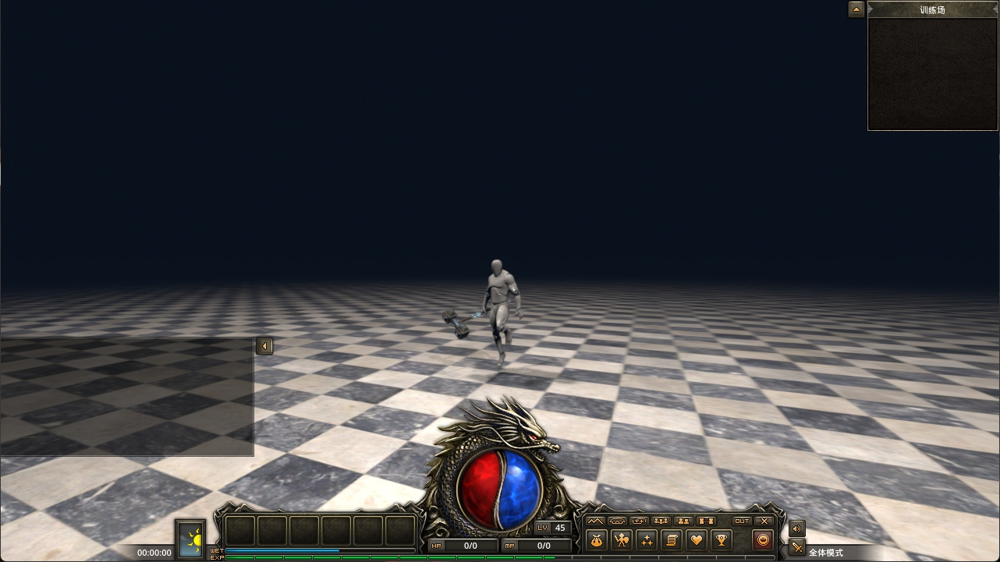

# GameForGodot

⚡ Game(3D MMORPG Game) For Godot ⚡



## License

[](https://opensource.org/licenses/Apache2.0)

## Basic Requirements

Your device should meet the following basic requirements.

```shell
Godot: 4.4.dev3
```

## Install

```shell
git clone git@github.com:makeryangcom/GameForGodot.git
```

Import the 'engine/project. godot' project in Godot.

## Developer

💡 We warmly welcome like-minded developers to join this open-source project and contribute to its thriving development. If you're highly interested, you can learn more through the following ways.

> <p style="font-size: 12px;">我们非常欢迎志同道合的开发者加入这个开源项目，促进这个开源项目的蓬勃发展，如果你非常的有兴趣，可以通过下面的方式进一步了解.</p>

## Special Thanks

<p style="font-size: 12px;">

[Godot](https://github.com/godotengine)

[落叶轻羽](https://space.bilibili.com/375301589)

[ImRains](https://space.bilibili.com/66079515)

[LeonXiang](https://space.bilibili.com/510940608)
</p>